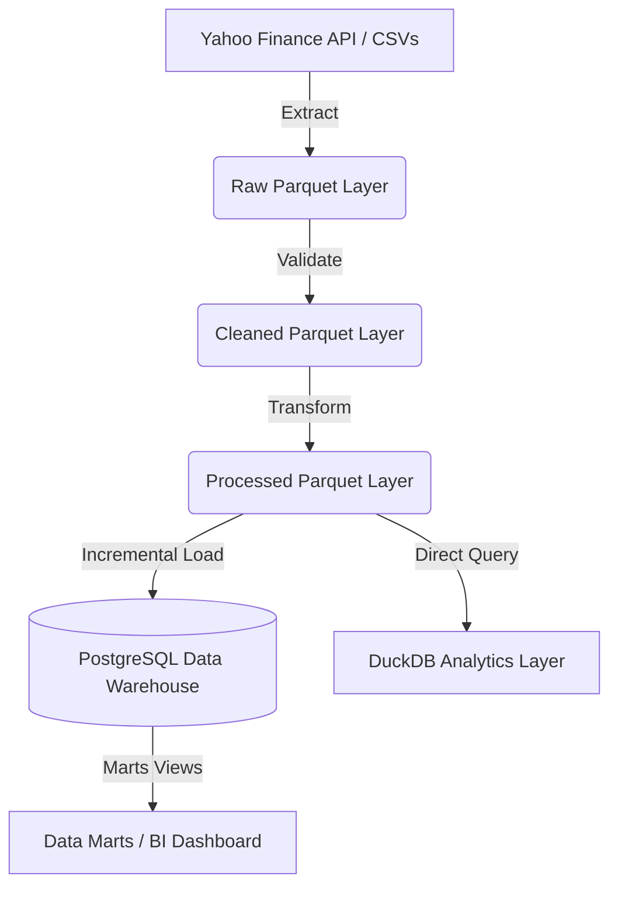

# Stock Market Data Pipeline

An end-to-end batch data pipeline that automates the collection, validation, transformation, and ingestion of stock market data into a PostgreSQL data warehouse.

## Project Overview

* **Problem**: Storing raw data in monolithic or unvalidated formats makes financial analysis slow and prone to errors. Traditional big data frameworks like Apache Spark are costly and over-engineered for small to medium-sized stock market datasets.
* **Solution**: A lightweight, modular pipeline that downloads data from Yahoo Finance API (with local CSV fallback), validates data quality, computes technical indicators, and upserts data into a relational warehouse.
* **Output**: A structured star-schema database in PostgreSQL, self-updating data marts for BI consumption, and processed Parquet files queryable via DuckDB.

## Architecture



### Data Flow
1. **Source to Raw**: Data is extracted from Yahoo Finance or local CSV fallbacks and saved as raw Parquet files.
2. **Validation to Transform**: Raw Parquet files are checked for schema, duplicate records, null values, and numeric boundary violations.
3. **Transform to Load**: Pandas computes rolling technical indicators before data is incrementally loaded (upserted) into the database.
4. **Local OLAP**: DuckDB queries processed Parquet files directly, bypassing the database for quick analytics.

## Tech Stack

| Technology | Purpose |
| :--- | :--- |
| Apache Airflow | Workflow orchestration, scheduling, and task monitoring |
| Pandas & NumPy | Data manipulation, schema validation, and indicator calculations |
| PostgreSQL | Primary data warehouse implementing a star schema |
| DuckDB | Serverless local OLAP database for direct Parquet queries |
| Docker & Docker Compose | Containerization of PostgreSQL and Apache Airflow |
| Pytest | Automated unit testing for pipeline validations and calculations |

## Pipeline Flow

* **Extraction**: Fetches data from Yahoo Finance API for configured tickers and saves them as raw Parquet files, with fallback to local CSVs.
* **Transformation**: Standardizes schema types, drops duplicates, filters invalid values, and computes rolling technical indicators (SMA, EMA, RSI, MACD, Bollinger Bands).
* **Loading**: Sequentially loads the date dimension table and upserts price and indicator records into PostgreSQL fact tables using key constraints.
* **Consumption**: Exposes database views (data marts) for BI dashboarding and supports local analytical SQL queries directly on Parquet files using DuckDB.

## Project Structure

```
stock-market-data-pipeline/
├── airflow/
│   └── dags/                  # Workflow configuration and DAGs
├── data/
│   ├── raw/                   # Landing zone for raw Parquet and CSV source files
│   └── processed/             # Cleaned Parquet datasets with computed indicators
├── sql/
│   ├── init_warehouse.sql     # PostgreSQL warehouse schema definitions and seed data
│   └── marts.sql              # Analytical views and data marts
├── src/
│   ├── extract.py             # Data extraction and fallback logic
│   ├── validate.py            # Quality gates and business boundary validation
│   ├── transform.py           # Technical indicators calculator
│   ├── load.py                # PostgreSQL incremental load processor
│   └── analytics.py           # DuckDB direct-query analytics engine
├── tests/
│   └── test_pipeline.py       # Automated unit tests
└── utils/
    ├── config.py              # Configuration manager via dotenv
    ├── db.py                  # Database connection helper
    ├── logger.py              # Standardized console logging
    ├── init_db.py             # Database initialization driver
    ├── check_postgres.py      # PostgreSQL query verification utility
    └── mart_verifier.py       # Database mart verification task
```

## Data Model

| Table Name | Type | Description | Keys |
| :--- | :--- | :--- | :--- |
| `dim_company` | Dimension | Company sector and industry metadata | Primary Key: `ticker` |
| `dim_date` | Dimension | Calendar attributes for temporal slicing | Primary Key: `date` |
| `fact_stock_price` | Fact | Historical stock prices (Open, High, Low, Close, Volume) | Composite Key: `(date, ticker)` |
| `fact_stock_indicator` | Fact | Computed technical indicators (SMA, EMA, RSI, MACD, Bollinger Bands) | Composite Key: `(date, ticker)` |
| `mart_stock_summary` | View (Mart) | Denormalized dataset combining prices, indicators, and company metadata | N/A |

## Key Features

* **Orchestration**: Uses Apache Airflow to handle task dependencies, scheduling, and automatic retries.
* **Data Quality Gates**: Prevents duplicate records, null values, or incorrect numeric ranges from entering the warehouse.
* **Incremental Ingestion**: Implements Postgres upserts (`ON CONFLICT DO UPDATE`) to load only new or updated records.
* **Serverless Analytics**: Enables analytical SQL queries directly on local Parquet files via DuckDB without database performance overhead.
* **Modular Codebase**: Decouples extract, validate, transform, and load steps into separate Python scripts for easy debugging and maintainability.

## Results

* **Automation**: Eliminates manual daily updates by scheduling batch pipelines.
* **Performance**: Direct local analytical querying executes in milliseconds using DuckDB.
* **Cost Efficiency**: Runs on consumer hardware via Docker, avoiding cloud warehouse costs.
* **Data Reliability**: Validates 100% of raw data, dropping corrupted or duplicate records automatically.

## How to Run

### Step 1: Initialize Configuration
Clone the repository and ensure your `.env` file matches the database configuration:
```bash
git clone https://github.com/AffandraF/stock-market-data-pipeline.git
cd stock-market-data-pipeline
```

### Step 2: Spin Up Infrastructure
Launch the PostgreSQL and Apache Airflow containers:
```bash
docker compose up -d
```

### Step 3: Run the Pipeline
Open the Apache Airflow dashboard at `http://localhost:8080` (Username: `admin`, Password: `admin`) and trigger the `stock_market_etl_pipeline` DAG.

### Step 4: Run Analytics and Verification
To query PostgreSQL database marts and export a summary CSV:
```bash
python utils/check_postgres.py
```
To run OLAP queries directly on Parquet files:
```bash
python src/analytics.py
```

### Step 5: Run Tests
Execute the test suite locally:
```bash
pip install -r requirements.txt
pytest tests/
```