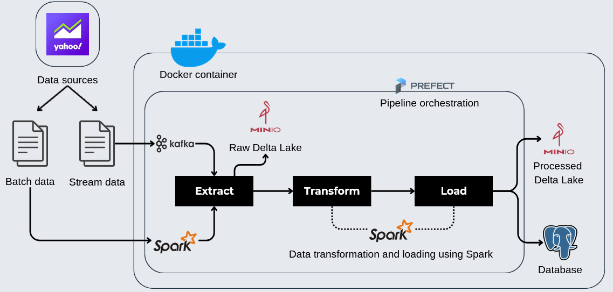
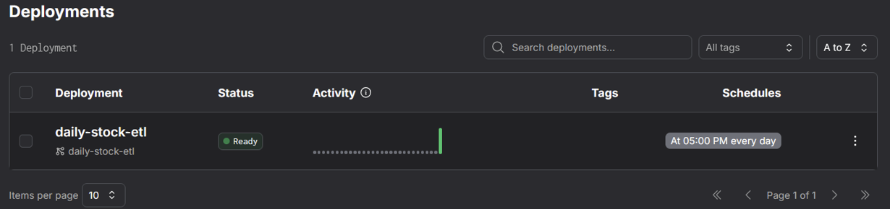
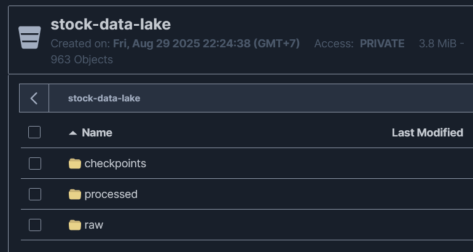
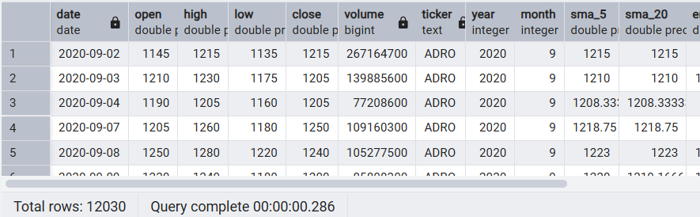

# Stock Market Data Pipeline

An end-to-end data pipeline that collects and processes daily stock market data. The project shows how to build a modern data system for both batch and real-time processing using stock data scraped from Yahoo Finance and saved as CSV files.

The goal is to build an automated system that fetches raw stock data, adds useful technical indicators, and stores it in a structured format ready for analysis, reporting, or machine learning.

---

## Technology Stack

- **Orchestration**: Prefect
- **Streaming**: Apache Kafka
- **Data Processing**: Apache Spark
- **Data Lake Storage**: Minio (S3-compatible) & Delta Lake
- **Data Warehouse/Serving**: PostgreSQL
- **Containerization**: Docker

---

## Architecture



The pipeline begins with data scraped from Yahoo Finance and stored in CSV files.

1.  **Extract**:
    - Read data from a CSV file.
    - For batch jobs, Spark loads the CSV directly.
    - For streaming, a producer script sends each CSV row to a Kafka topic.
2.  **Transform**:
    - Spark reads raw data from Delta Lake stored in MinIO.
    - It calculates technical indicators and creates a processed dataset.
3.  **Load**:
    - The processed data is loaded into PostgreSQL for use by other applications.

---

## Installation

To get this project running locally, please ensure you have **Docker** and **Docker Compose** installed on your machine.

1.  **Clone the repository:**

    ```sh
    git clone https://github.com/AffandraF/stock-market-data-pipeline.git
    cd stock-market-data-pipeline
    ```

2.  **Build and start the services:**
    This command will build the necessary Docker images and start all the services (Prefect, Kafka, Spark, Minio, and PostgreSQL) in detached mode.
    ```sh
    docker compose up -d
    ```

All services should now be running. You can verify this by running `docker compose ps`.

---

## Usage

Once the installation is complete, you can run the data pipeline using one of the following methods.

1.  Open your web browser and navigate to the Prefect UI, typically at **http://localhost:4200**.
2.  Go to the "Deployments" page and find the daily-stock-etl deployment.
3.  Click on it and select "Quick Run" to start the pipeline. You can monitor the flow’s progress in real time from the UI.

## Result


